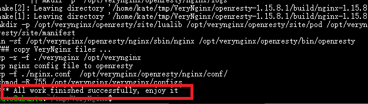
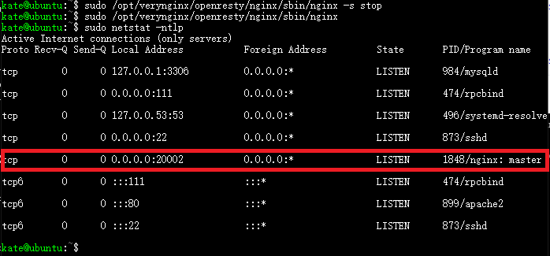

## 实验环境

+ win 10 主机

+ VirtualBox

+ ubuntu 18.04
+ nginx version ：nginx1.14.0(Ubuntu)
+ verynginx

## 实验目的


## 安装配置VeryNginx

### 根据[官方手册]( https://github.com/alexazhou/VeryNginx/blob/master/readme_zh.md )进行安装

+  安装命令

  ```shell
  cd tmp/
  #克隆verynbinx的仓库到ubuntu虚拟机中
  git clone https://github.com/alexazhou/VeryNginx.git
  
  # 安装python以及相应的依赖
  sudo apt insatll python
  sudo apt install  libssl-dev libpcre3 libpcre3-dev build-essential
  sudo apt-get install zlib1g.dev
  
  #进行verynginx目录
  cd VeryNginx
  
  # 运行install.py
  sudo python install.py install
  ```

+ 安装成功截图

  

+ 安装时遇到的报错

  ```powershell
  ./configure: error: the HTTP gzip module requires the zlib library.
  You can either disable the module by using –without-http_gzip_module
  option, or install the zlib library into the system, or build the zlib
  library
  statically from the source with nginx by using –with-zlib=<path> option.
  ```

  + 解决方法

    ```shell
    sudo apt-get install zlib1g.dev
    ```

###  修改配置文件

+ 使用命令

  ```shell
  sudo vim /opt/verynginx/openresty/nginx/conf/nginx.conf
  # 将user从nginx修改为系统中的默认用户www-date
  # 修改server为  :20002
  # :wq!
  #修改权限，主目录权限给www-date
  sudo chown -R www-data.www-data /opt/verynginx/
  ```

+ 遇到的问题：之前添加host-only网卡一直设置无效，尝试多种方法仍然无法有效设置。

  + 解决方法：采用桥接网卡代替host-only+Nat，但要将桥接网卡的ip设置成静态分配的，以便主机每次都通过同一ip访问客机。

    >#-----------------------------------------------------  补充知识 -------------------------------------------------------------
    >
    >| 如何访问     | host-only网卡 | Nat    | 桥接 |
    >| ------------ | ------------- | ------ | ---- |
    >| 主机访问客机 | 允许          | 不允许 | 允许 |
    >| 客机访问主机 | 允许          | 允许   | 允许 |
    >| 客机访问公网 | 不允许        | 允许   | 允许 |
    >| 公网访问客机 | 不允许        | 不允许 | 允许 |
    >
    >该实验中，host-only作用是允许主机通过web访问客机的verynhinx服务，Nat网卡的作用是用来上网，即客机访问公网。桥接模式下，这两种功能都可以实现，故在无法配置host-only网卡的情况下，采用桥接模式作为替用方案。
    >
    >----------------------------------------------------------   补充知识     ----------------------------------------------------#

    + 改变桥接网卡的ip为静态：

    

  

### 修改client的hosts文件

+ 在windows主机中的`C:\Windows\System32\drivers\etc\hosts`加入一条DNS解析`192.168.1.250  vn.sec.cuc.edu.cn  `即可使用域名访问verynginx

### 启动 verynginx服务

+ 命令

  ```shell
  #启动服务
  /opt/verynginx/openresty/nginx/sbin/nginx
  
  #---------------   补充 ------------------- #
  
  #停止服务命令
  /opt/verynginx/openresty/nginx/sbin/nginx -s stop
  
  #重启服务
  /opt/verynginx/openresty/nginx/sbin/nginx -s reload
  ```

+ 启动成功截图

  

+ verynginx监听端口为80，启动服务时报错 : 端口被占用

  ```shell
  Starting nginx: nginx: [emerg] bind() to 0.0.0.0:80 failed (98: Address already in use)
  
  nginx: [emerg] bind() to 0.0.0.0:80 failed (98: Address already in use)
  nginx: [emerg] bind() to 0.0.0.0:80 failed (98: Address already in use)
  nginx: [emerg] bind() to 0.0.0.0:80 failed (98: Address already in use)
  nginx: [emerg] bind() to 0.0.0.0:80 failed (98: Address already in use)
  nginx: [emerg] still could not bind()
  ```

  + 解决方法1：关闭占用80端口的apache2服务，但下次重启ubuntu后80端口又会被apache2占用

    ```shell
    # 查看端口占用情况,显示80端口apache2服务占用
    sudo netstat -ntlp
    
    # 查看apache2的进程 
    ps -A | grep apache2
    
    # 关闭apaache2服务
    sudo /etc/init.d/apache2 stop 
    ```

  + 解决方法2：改变verynginx监听的端口为20002。（2000以下端口可能有特殊用途，最好在20000-60000之间取值。这里选取20002端口）

### WEB访问

+ 通过web面板对verynginx进行配置，在浏览器访问`http:\vn.sec.cuc.edu.cn\verynginx\index.html:20002`。默认用户名和密码是`verynginx/verynginx`。登录之后就可以查看状态，并修改配置。

  使用域名登录成功截图：

  


## 安装配置nginx

### [安装nginx](https://www.digitalocean.com/community/tutorials/how-to-install-linux-nginx-mysql-php-lemp-stack-ubuntu-18-04)

```shell
# 安装Ngix
sudo apt install nginx

#修改nginx server的监听端口为20003
sudo vim /etc/nginx/sites-enabled/default

#启动nginx服务
sudo systemctl start nginx
```


## 安装nginx

### 安装mysql

```mysql
# 安装mysql
sudo apt install mysql-server

#进入mysql（默认root账户是没有密码的）
sudo mysql

# 为root账号添加密码
ALTER USER 'root'@'localhost' IDENTIFIED WITH mysql_native_password BY '123456';

#刷新策略
FLUSH PRIVILEGES;

# 查看user的认证方式
SELECT user,authentication_string,plugin,host FROM mysql.user;

```


### 安装php，并配置nginx使用php

```shell
# 安装php
sudo add-apt-repository universe
sudo apt install php-fpm php-mysql

#配置nginx使用php（文件名（nginx_php-fpm）随意）
# 不直接修改defult文件，以便在需要恢复原始设置时可再次直接使用defult文件
sudo nano /etc/nginx/sites-available/nginx_php-fpm
# 稍稍修改一下/etc/nginx/sites-enabled/default 中的内容，并添加到nginx_php-fpm文件中（见下面截图）

#创建从服务器块配置文件到/etc/nginx/sites-enabled/目录的符号链接来启用新服务器块：
sudo ln -s /etc/nginx/sites-available/nginx_php-fpm /etc/nginx/sites-enabled/

#从/sites-enabled/目录取消链接默认配置文件：
sudo unlink /etc/nginx/sites-enabled/default

# 检查新配置文件中的语法错误等（结果见下方第二张图）
sudo nginx -t

#重新加载Nginx进行必要的修改
sudo systemctl reload nginx

#------------------------- 补充 ---------------------------

#如果要恢复默认配置，可以通过重新创建连接来完成，并取消对nginx_php-fpm的连接
sudo ln -s /etc/nginx/sites-available/default /etc/nginx/sites-enabled/
sudo unlink /etc/nginx/sites-enabled/nginx_php-fpm
##注意：ln -s  以及 unlink  语法后一定要跟绝对路径，相对路径一般会报错 ##
#------------------------- 补充 ---------------------------
```


##  安装wordpress

[wordpress安装]( [https://www.digitalocean.com/community/tutorials/how-to-install-wordpress-with-lemp-on-ubuntu-18-04#step-1-%E2%80%94-creating-a-mysql-database-and-user-for-wordpress](https://www.digitalocean.com/community/tutorials/how-to-install-wordpress-with-lemp-on-ubuntu-18-04#step-1-—-creating-a-mysql-database-and-user-for-wordpress) )

###  Creating a MySQL Database and User for WordPress

```SHELL
sudo apt install mysql-server
sudo mysql
mysql> CREATE DATABASE wordpress DEFAULT CHARACTER SET utf8 COLLATE utf8_unicode_ci;
mysql>GRANT ALL ON wordpress.* TO 'wordpressuser'@'localhost' IDENTIFIED BY '123456';
mysql>FLUSH PRIVILEGES;
mysql>exit;
```


### Installing additional php extensions

```shell
sudo apt update
sudo apt install php-curl php-gd php-intl php-mbstring php-soap php-xml php-xmlrpc php-zip
sudo systemctl restart php7.2-fpm
```

###  Configuring nginx

```shell
sudo cp /etc/nginx/sites-available/nginx_php-fpm /etc/nginx/sites-available/wordpress
# 修改配置
sudo vim /etc/nginx/sites-available/wordpress
# 将其修改至下图所示的状态
sudo unlink /etc/nginx/sites-enabled/nginx_php-fpm 
sudo ln -s /etc/nginx/sites-available/wordpress /etc/nginx/sites-enabled/
sudo nginx -t (检查结果：ok)
```


### Downloading WordPress

```shell
cd /tmp
curl -LO https://wordpress.org/latest.tar.gz
tar xzvf latest.tar.gz
cp /tmp/wordpress/wp-config-sample.php /tmp/wordpress/wp-config.php
sudo cp -a /tmp/wordpress/.  /var/www/html/wp.sec.cuc.edu.cn/
```

### 修改client的hosts文件

+ 在windows主机中的`C:\Windows\System32\drivers\etc\hosts`加入一条DNS解析`192.168.1.250  wp.sec.cuc.edu.cn  `, url`wp.sec.cuc.edu.cn：20003/wordpress/wp-admin/`访问wordpress进行配置,选择语言，然后连接数据库,设置完wordpress用户名密码即可访问wordpress网站。 

```shell
# 登录信息
# database name : wordpress
# database user name : wordpressuser
#database paword : 123456
# database host : 127.0.0.1
```


## DVWA

[DVWA安装]( https://kifarunix.com/how-to-setup-damn-vulnerable-web-app-lab-on-ubuntu-18-04-server/ )

### 安装

```shell
git clone https://github.com/ethicalhack3r/DVWA /tmp/DVWA
sudo rsync -avP /tmp/DVWA/ /var/www/html 
sudo cp /var/www/html/config/config.inc.php.dist /var/www/html/config/config.inc.php/
# 修改/var/www/html/config/config.inc.php/中的$_DVWA[ 'db_password' ] = '123456';
```

### 创建database

```mysql
# 创建新的数据库
mysql> create database dvwa;
mysql> grant all on dvwa.* to dvwa@localhost identified by '123456';
mysql> flush privileges;
mysql> quit
# 查询数据库
mysql> show databases;
systemctl restart mysql
```

###   设置DVWA文件夹访问权限 

```
chown -R www-data.www-data /var/www/html/
```

 ### 配置nginx 20004端口监听DVWA的访问

```shell
sudo vim /etc/nginx/sites-enabled/dvwa
# 添加下图内容
sudo unlink /etc/nginx/sites-enabled/wordpress 
sudo ln -s /etc/nginx/sites-available/dvwa /etc/nginx/sites-enabled/
sudo nginx -t (检查结果：ok)
#重启nginx使配置生效
sudo systemctl restart nginx
```


### web访问

使用`192.169.1.250:20004/setup.php`访问


###  login in

在主机hosts添加` 169.168.1.250 dvwa.sec.cuc.edu.cn `

 并点击`setup.php`页面下方的**Create/Reset Database**生成需要使用的数据库。如果数据库连接成功，页面会直接重定向到登录页面，如下图，使用 admin/password登录。 

登录成功界面如图:


## 实验检查点

###  基本要求

+ 在一台主机（虚拟机）上同时配置[Nginx](http://nginx.org/)[VeryNginx](https://github.com/alexazhou/VeryNginx)
  + VeryNginx作为本次实验的Web App的反向代理服务器和WAF
  
+ PHP-FPM进程的反向代理配置在nginx服务器上，VeryNginx服务器不直接配置Web站点服务 
  
    + 在verynginx中配置
  
      + 配置matcher
  
        
  
      + 配置upstream和proxy
  
        
  
        
  
+ 使用[Wordpress](https://wordpress.org/)搭建的站点对外提供访问的地址为： http://wp.sec.cuc.edu.cn

+ 使用[Damn Vulnerable Web Application (DVWA)](http://www.dvwa.co.uk/)搭建的站点对外提供访问的地址为： http://dvwa.sec.cuc.edu.cn

  + [配置文件](image\nginx_wordpress_dvwa_config.PNG)
  + wordpress和dvwa搭建站点访问情况：

  

### 安全加固要求

- 使用IP地址方式均无法访问上述任意站点，并向访客展示自定义的**友好错误提示信息页面-1**
- [Damn Vulnerable Web Application (DVWA)](http://www.dvwa.co.uk/)只允许白名单上的访客来源IP，其他来源的IP访问均向访客展示自定义的**友好错误提示信息页面-2**
- 在不升级Wordpress版本的情况下，通过定制[VeryNginx](https://github.com/alexazhou/VeryNginx)的访问控制策略规则，**热**修复[WordPress < 4.7.1 - Username Enumeration](https://www.exploit-db.com/exploits/41497/)
- 通过配置[VeryNginx](https://github.com/alexazhou/VeryNginx)的Filter规则实现对[Damn Vulnerable Web Application (DVWA)](http://www.dvwa.co.uk/)的SQL注入实验在低安全等级条件下进行防护


### 参考文献

+ [how to install wordpress with LEMP on Ubuntu 18.04]( https://www.digitalocean.com/community/tutorials/how-to-install-wordpress-with-lemp-on-ubuntu-18-04 )
+ [How To Install Linux, Nginx, MySQL, PHP (LEMP stack) on Ubuntu 18.04]( https://www.digitalocean.com/community/tutorials/how-to-install-linux-nginx-mysql-php-lemp-stack-ubuntu-18-04 )
+ [How To Install WordPress with LEMP on Ubuntu 18.04]( [https://www.digitalocean.com/community/tutorials/how-to-install-wordpress-with-lemp-on-ubuntu-18-04#step-1-%E2%80%94-creating-a-mysql-database-and-user-for-wordpress](https://www.digitalocean.com/community/tutorials/how-to-install-wordpress-with-lemp-on-ubuntu-18-04#step-1-—-creating-a-mysql-database-and-user-for-wordpress) )
+ [how-to-setup-damn-vulnerable-web-app-lab-on-ubuntu-18-04-server]( https://kifarunix.com/how-to-setup-damn-vulnerable-web-app-lab-on-ubuntu-18-04-server/ )
+ [ https://www.virtualbox.org]( https://www.virtualbox.org/manual/ch08.html#vboxmanage-modifyvm )
+ [VirtualBox不同网卡的上网规则](blog.csdn.net/nsxqf/article/details/83543563)
+ [如何将桥接模式的ip配置为静态ip]( https://www.cnblogs.com/GHzcx/p/9641234.html )


