## 实验环境

+ VirtualBox
+ server: ubuntu 18.04
  + hostonly: 192.168.56.104
+ client : ubuntu18.04
  + hostonly:192.168.56.103

## 工作主机免密SSH登录目标主机

### 生成并导入SSH-KEY至目标主机

+ 在工作主机生成ssh-key

  ```shell
  #生成公私钥 fo为key的名称
  ssh-keygen -f fo
  ```

+ 修改目标主机的`/etc/ssh/sshd_config`配置

  ```shell
  # 设置可通过口令认证SSH
  PasswordAuthentication yes
  # 可以root用户登录
  PermitRootLogin yes
  ```

+ 重启目标主机服务器

  ```shell
  sudo systemctl restart ssh
  sudo passwd　12345678
  ```

+ 工作主机通过```ssh-copy-id```方式导入ssh-key

  ```shell
  ssh-copy-id -i ~/foo root@192.168.56.104
  ```

###  设置免密登录

+ 取消root口令并禁用口令登录

  ```shell
  sudo passwd -l root
  # 修改目标主机配置文件
  vim /etc/ssh/sshd_config
  PasswordAuthentication no
  PermitRootLogin without-password
  
  # 重启ssh服务
  sudo systemctl restart ssh
  ```


### 实验结果

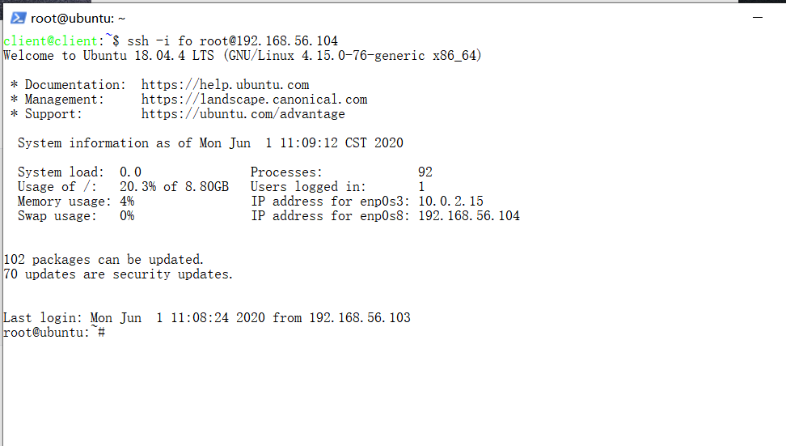

## FPD

### 服务器选择

1. 备选服务器

   |      | 可选服务器 |
   | ---- | ---------- |
   | 1    | ftpd       |
   | 2    | vsftpd     |
   | 3    | proftpd    |
   | 4    | pure-ftpd  |

   

2. 服务器选择要求

   

   |      | FTP服务器应满足的功能特性、安全特性                          |
   | ---- | ------------------------------------------------------------ |
   | １   | 可以提供匿名访问的服务，匿名访问者可以访问1个目录且仅拥有该目录及其所有子目录的只读访问权限 |
   | ２   | 支持用户名和密码方式访问的账号，该账号继承匿名访问者所有权限，且拥有对另1个独立目录及其子目录完整读写（包括创建目录、修改文件、删除文件等）权限； |
   | ３   | 该账号仅可用于FTP服务访问，不能用于系统shell登录；FTP用户不能越权访问指定目录之外的任意其他目录和文件 |
   | ４   | 匿名访问权限仅限白名单IP来源用户访问，禁止白名单IP以外的访问； |

3. 四类服务器特性、功能清单

   + ftpd:  are recommended to use one of its alternatives, such as vsftpd, proftpd, or pure-ftpd。so donnot use it。
   + vsftpd: 轻量型；在很多大型站点广泛使用，受到更为严格的审查，更为安全；社区活跃，有较多的参考资料。
   +  proftpd: 功能丰富；可用插件多； 配置简单；支持多种操作系统；ProETPd列出了最多的CVE漏洞，使用广泛。
   +  pure-ftpd: 安全至上的理念，安全漏洞最；配置简单；支持多种操作系统。

   综上，选择轻量型，应用广泛，社区活跃的vsftpd做为本次实验的服务器。

### 实验文件

+ 脚本：[vsftpd.sh](scripts/vsftpd.sh)

+ 配置文件: [vsftpd.conf](config/vsftpd.conf)

+ 语法补充

  ```shell
  command -v vsftpd > /dev/null
  #将标准输出重定向到黑洞文件，若vsftpd已安装，该命令返回0
  
  $?
  #表示上次命令的返回结果
  
  if [[ ! -f "${filename}" ]];
  #如果文件filename不存在的判断语句
  
  mkdir -p dir1/dir
  #-p参数保证了当dir1目录不存在时，创建dir1目录，而不是报错
  
  sed -i -e "/text1/s/a/b/g"　file
  #使用-i参数表示，在对文件进行操作时，命令的结果替换原始的结果
  #sed "/text/"表示匹配所有text开头的行
  #"s/a/b/2g" 表示在选定行中找到a并将其替换成b,2g表示从a第二次出现开始匹配，g表示从a第一次出现开始匹配。"/^[#]"表示从开头开始匹配#
  #-e 允许一个sed中执行多个命令
  
  grep -c
  #计数
  grep -q
  #查询
  
  chown a-w
  #u 表示该文件的拥有者，g 表示与该文件的拥有者属于同一个群体(group)者，o 表示其他以外的人，a 表示这三者皆是。
  #-w表示取消写的权限
  ```

### 在主机上运行`vsftpd.sh`脚本

[](https://asciinema.org/a/9yc2lAEM4ZGK9u5N5HOA4wGBA)

### 配置要求实现展示

+ 配置一个提供匿名访问的FTP服务器，匿名访问者可以访问1个目录且仅拥有该目录及其所有子目录的只读访问权限

  + 提供匿名访问

    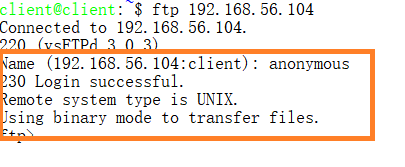

  + 拥有一个目录及子文件的只读访问权限

    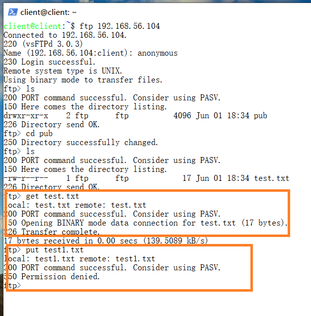

+ 配置一个支持用户名和密码方式访问的账号，该账号继承匿名访问者所有权限，且拥有对另1个独立目录及其子目录完整读写权限

  + 支持用户名密码方式登录

    

  + 该账号继承匿名访问者对一个目录及其子目录的只读访问权。

    该账户对host_only文件夹下文件有下载权限，无上传的权限

    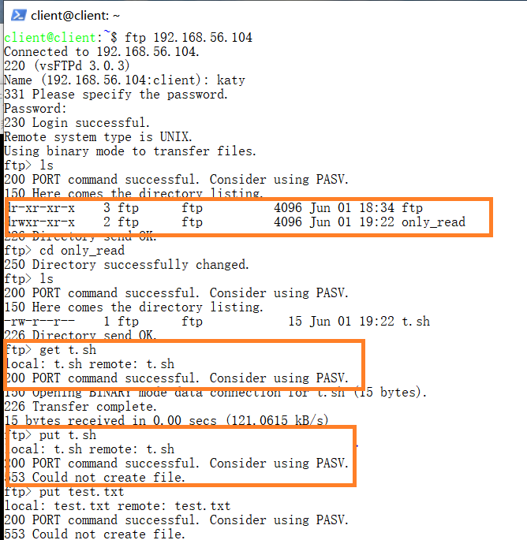

  + katy账号具有对files文件夹及其子文件夹的完整读写权限

    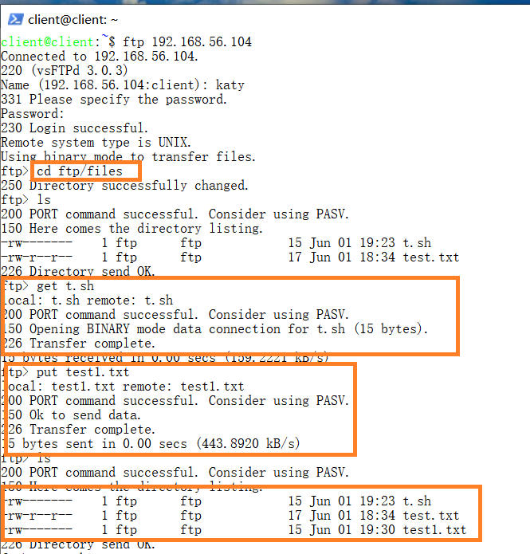

+ FTP用户不能越权访问指定目录之外的任意其他目录和文件

  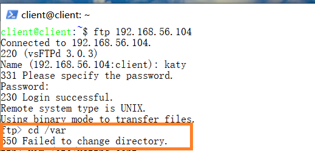

+ 匿名访问权限仅限白名单IP来源用户访问，禁止白名单IP以外的访问   

  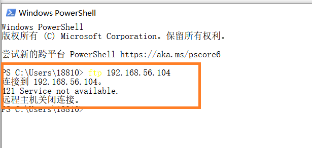

## NFS

### 实验文件

+ 脚本:[nfs_client.sh](scripts/nfs_client.sh),[nfs_host.sh](scripts/nfs_host.sh)
+ 配置文件[exports](config/exports)

### 在服务器上运行脚本

+ 将脚本从工作主机copy到服务器：

  ```shell
  scp -i fo nfs_host.sh root@192.168.56.104
  ```

+ 在服务器端运行脚本

  [](https://asciinema.org/a/mv5h1nVsBpEgffbbR2G6zFla5)

+ 在工作主机运行脚本

  [](https://asciinema.org/a/vdxCBmrmPPRF8qKww4oamcDKj)

  

### 配置要求展示

在1台Linux上配置NFS服务，另1台电脑上配置NFS客户端挂载2个权限不同的共享目录，分别对应只读访问和读写访问权限；

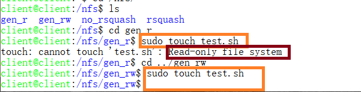

- 共享目录中文件、子目录的属主、权限信

  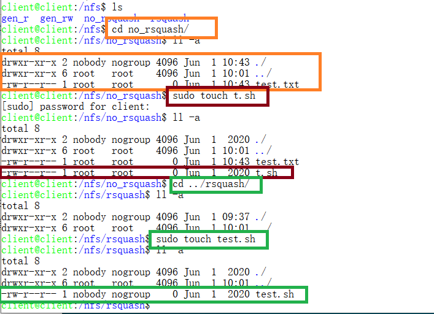

- 你通过NFS客户端在NFS共享目录中新建的目录、创建的文件的属主、权限信息

  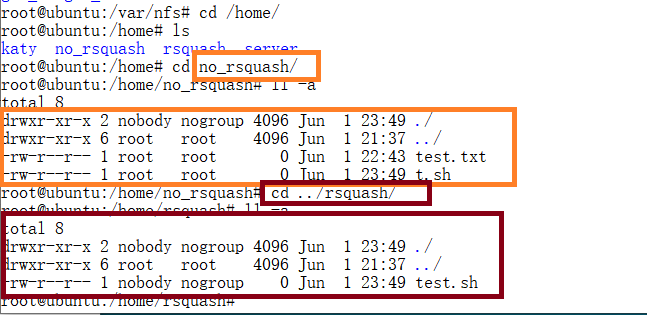

- 上述共享目录中文件、子目录的属主、权限信息和在NFS服务器端上查看到的信息一样吗？无论是否一致，请给出你查到的资料是如何讲解NFS目录中的属主和属主组信息应该如何正确解读

  + root_squash是为客户端分配服务器访问权限时的参数，其分别表示：  
    + no_root_squash：登入 NFS 主机使用分享目录的使用者，如果是 root 的话，那么对于这个分享的目录来说，他就具有 root 的权限！ 
    + root_squash：在登入 NFS 主机使用分享之目录的使用者如果是 root 时，那么这个使用者的权限将被压缩成为匿名使用者，通常他的 UID 与 GID 都会变成 nobody 那个系统账号的身份。   

##  DHCP

### 实验文件

+ 脚本：[dhcp.sh](scripts/dhcp/sh)
+ 配置文件[vsftpd.conf](config/vsftpd.conf),[isc-dhcp-server](config/isc-dhcp-server),[01-netcfg.yaml](config/01-netcfg.yaml)

### 实验过程

+ 服务器网卡配置

  + `/etc/netplan/01-netcfg.yaml`

  ```
  network:
  version: 2
  renderer: networkd
  ethernets:
      enp0s3:
          dhcp4: yes
      enp0s8:
          dhcp4: yes
      enp0s9:
          # 必须静态配置
          dhcp4: no
          addresses: [192.168.57.1/24]
  ```

+ 工作主机网卡配置

  + 修改`/etc/netplan/01-netcfg.yaml`如下：

    ```shell
    network:
    version: 2
    renderer: networkd
    ethernets:
        enp0s3:
            dhcp4: yes
        enp0s8:
            dhcp4: yes
        enp0s9:
            dhcp4: yes
    ```

  + `sudo netplan apply`

+ 在服务器上运行脚本
+ 在工作主机上修改网卡配置并重启

### 实验结果

+ isc-dhcp-server failed!原因未知

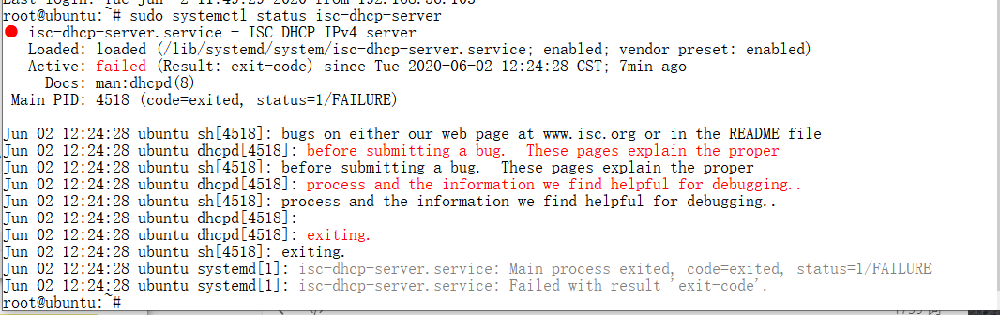

## DNS

#### 

## Samba

### 实验文件

+ 脚本: [samba.sh](scripts/samba.sh)

### 实验过程

+ windows端：

  + 匿名用户共享目录

    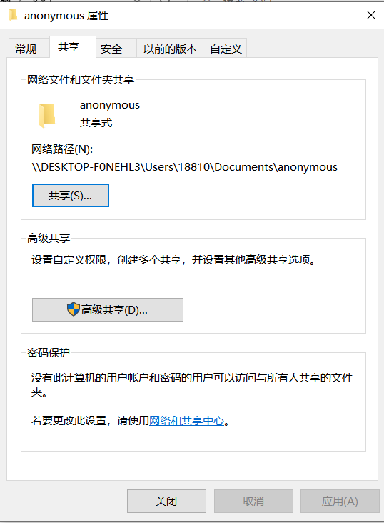

  + 账号密码方式登录

    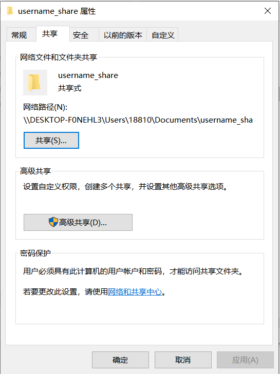

+ linux端：运行脚本

### 试验结果

未成功

## 参考文献

+ [how-to-set-up-passwordless-ssh-access-for-root-user ]( https://askubuntu.com/questions/115151/how-to-set-up-passwordless-ssh-access-for-root-user )
+ [ https://man.linuxde.net/sed ]( https://man.linuxde.net/sed )
+ [how-to-set-up-vsftpd-for-a-user-s-directory-on-ubuntu-18-04](https://www.digitalocean.com/community/tutorials/how-to-set-up-vsftpd-for-a-user-s-directory-on-ubuntu-18-04)
+ [vsftpd-limit-connection-to-a-set-of-ip-addresses](https://serverfault.com/questions/577393/vsftpd-limit-connection-to-a-set-of-ip-addresses)
+ [how-to-set-up-an-nfs-mount-on-ubuntu-18-04](https://www.digitalocean.com/community/tutorials/how-to-set-up-an-nfs-mount-on-ubuntu-18-04)

